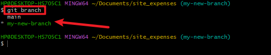
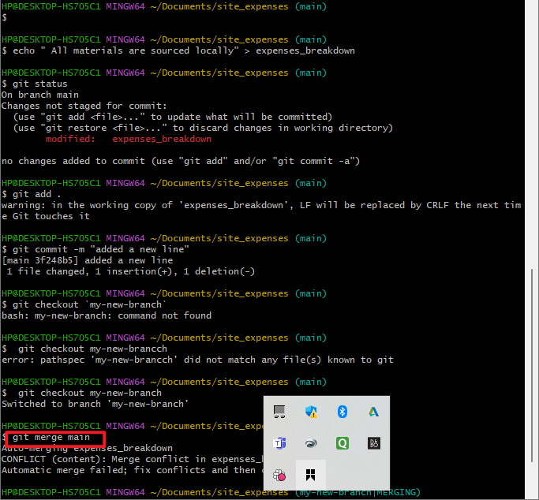
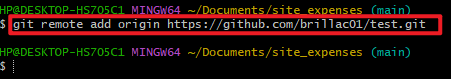
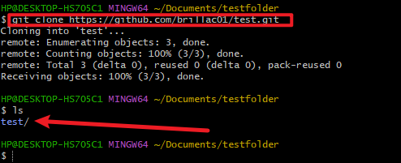

## Initialising repository and making commits

Before diving int our main objectives, which is initializing git and making commits, lets start by introducing git.

# What is Git?

Git is a distributed version control system that helps developers keep track of code changes. It is used to collaborate on code and is widely used in the software development industry.

git adopted differnt approach, it allows developers to have their copy of the central repository. That is why it is reffered to as a Distributed version control system.

## Initialising a Git repository.

 - Open git Bash terminal on your computer.

 - On your terminal, create your working folder, use ``mkdir``

 - Change into your working directory using ``cd``

 - While you are inside the folder, run ``git init`` command

## Making your first commit

In the last section we successfully created our working directory and initialised it a git repository. Now we will make our first commit.

What is commmit ? Commit is more or less saving the changes you made to your file. Changes can be adding, modifying or deleting files or text.

Lets make your first commit

- Inside oyur working directory,create text file using this command `touch git`

- write any text of your choice in the text file, after ward save your changes

- Add your changes to git, using this command `git add .` 

- To Commit your changes to git,run this commands `git commit -m "initial commit"` 

The -m flag is used to provide commit message. The commit message is a nice way to provide context about the commit.when writting a commit message, makes it descriptive as possible. Lets it explain why the commit was made.

## Working with Branches.

Git branch helps you create a copy of the source code, In your new branch, you make changes as your please.

Your changes would be independent of what is available in the main copy. Git branch is commonly used to to develop new feature of your application.

Git branch is also a good tool for collaboration, within remote teams, Developers working from different location.They can make seperate branches while working on the same features. And at the end of the day,converge their codes to one branch.

# Making your first Git Branch.

To make new a new branch run this command `git checkout -b` 

The -b flag helps you create and change into the new branch.

Steps to make a new branch;

Make your new branch by following this command
 `git checkout -b my-new-branch`

 

 # Listing your Git Branches.

Use the command below to list the branch on your local gits repository.

`git branch`

# Change into an Old branch.

To change into the old branch use this command

`git checkout <master>`

# Merging branch with another branch.

Lets we have two branch A and B, and we want to add content B into A, First we change into branch A and then run this command 

`git merge B`

# Deleting Git branch.

To delete Git branch, run this command

`git branch -D < branch name >`

This is by no means all you can do with branches in gits, run this command on your terminal to know more 

`git branch --help`

## Collaboration and remote repositories.

# Collaboration and remote repositories.

Lets recap what we have learnt so far, we learnt that git is distribution control system, that essentially solves the problem of sharing source code and tracking changes made to the source code.

We also learnt about initialising git repository in our local machine, creating commit branches etc.

We also mention that git is used for collaboration among remote teams (of developers from different remote location). With Github being a web base platform, developers can work remotely and collaborately on the same code base.

## Pushing your local git repository to your remote github repository

In previuos lessons, we have written. Our friend is interested in contributing to our story, but he is unable to do so because we currently have our story in our local machine.

Having created a github account and a github repository in earlier steps. Lets send a copy of our story to our repository in github.

We will achieve this, by folowing the following steps

- Add a remote repository to the local repository using the command below.

`git remote add origin <link your github repo>`

The word origin refers to your remote repo link, it evluates the remote repo. url. it can be any word you choose

## Cloning remote git repository.

In the last lesson, we successfully added remote git repository and pushed our story in the local repository. Now your friend can make contribution to the story.

Give it a thought, will he be working on our story on github directly or he will create a local copy ?

Best Practices dictates that he makes a local copy of the the story from github to his local machine, create a branch where he can make all modifications he sees fit .

But how is he gpoing to make a local copy of our story in his local machine? Git clone command will do the rescue

The git clone command help us make a copy of remote repository in our local machine. The command is as follows:

`git clone < link to your remote repository >`

# Branch Management and Tagging.

## Introduction to Markdown syntax.

Markdown syntax is a light weight markup language that is widely used for formatting plain text. It allows you to add formatting element to your text without using complex HTML OR other formatting language. Markdown is commonly used for creating document, README files, forum posts, and even web pages

Here are the most commonly used markdown syntax element:

- To create headings, ues the hash symbol and the beginning of the line, The number of hash symbols, indicates the level of headings

`# heading`
`## heading`
`### heading`

- Emphasis : asterisks or underscore is used to emphasize a text

`*italic* or _italic_`
`**bold** or __ bold__`

-Lists: Markdown has support for both ordered and unordered

unordered list example

`item 1`
`item 2`
`item 3`

- To Create an hyperlink, use square bracket for the link text followed by parenthesis containing the URL

`[visit dare.io](https://app.darey.io/learning/project)`

- Images: To display an image, use an exclamation mark followed by square brackets for all the text and parenthesis, containing the URL
 ``

- Code: To display code or code snippets, use backtick (``) to enclose the code

 example

 console .log(`welcome to Darey.io`)

 Like I said earlier, list above are the most commonly used markdown syntax elements. 
 
 

